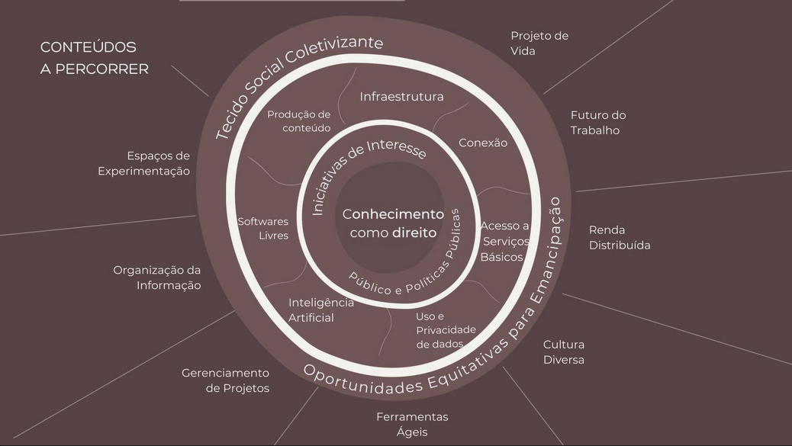

O relatório ID21 parte das [contribuições](../videos) de um grupo de pessoas historicamente ligadas a projetos de inclusão digital no Brasil para construir uma visão geral sobre as questões atuais em projetos de tecnologia em comunidades em 2021. 

O relatório pode ser encontrado [neste repositório](ID21_0-5.pdf) ou no [Internet Archive](https://archive.org/details/ID21_0-5). Seu conteúdo será usado para construir o acervo educacional [fonte.wiki](https://fonte.wiki).
